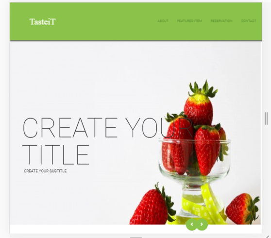
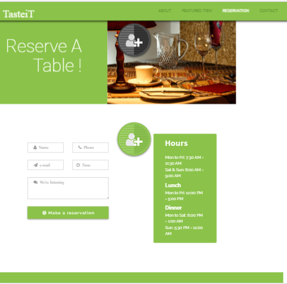
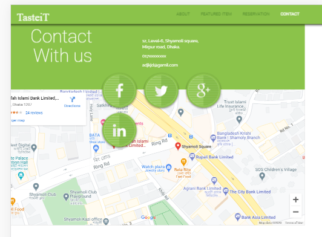
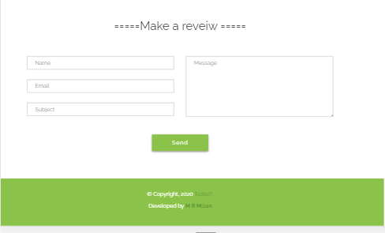
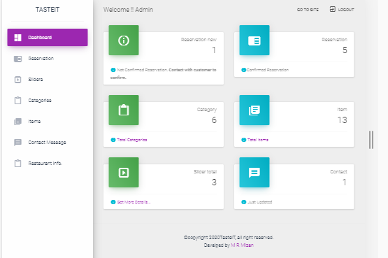

Restaurant website
username:admin@testgmail.com
password:rootadmin.
Description:

 In this website admin can manage slider, item,category, contact message, reservation and restaurant information. User can see item ,restauran info. User can reserv a table . When admin confirm the reservation 
A confirmation Email sent to user .
 
 Frontend: Bootstrap,jquery.
 backend: laravel, mysql.
 
 -----------------------------Screenshoot------------------------------------------

